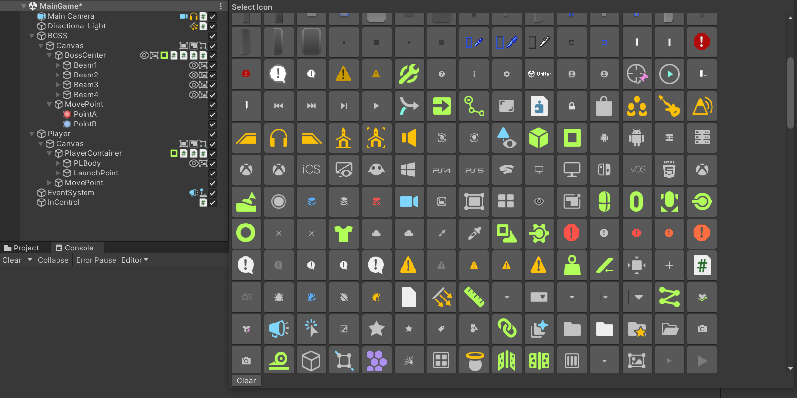
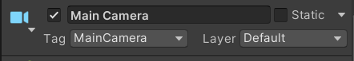

# Read Me
オブジェクトにカメラとかのアイコンつけたら分かりやすいのではないかという思い付きで製作。<br>
右クリックでアイコンがずらりと並んだウィンドウが表示されます。<br>
<br>
アイコンをクリックで変更されます。<br>
<br>
インスペクターの方もしっかりと変わります。

## TODOというかやりたいけど、できなかったこと
デフォルトであるアイコンが消せずに残り続ける事。<br>
調べてもうまく出てこないので手詰まりです(;'∀')

## 使い方

①「Editor」というフォルダをダウンロードする<br>
②「Assets」フォルダにダウンロードしたファイルを入れる<br>
③終わり！！<br>

```
Assets
├Editor
│  ├HierarchyIcon.cs
│  └IconSelectionWindow.cs
```

この様なフォルダ構成になっていたら成功です。
